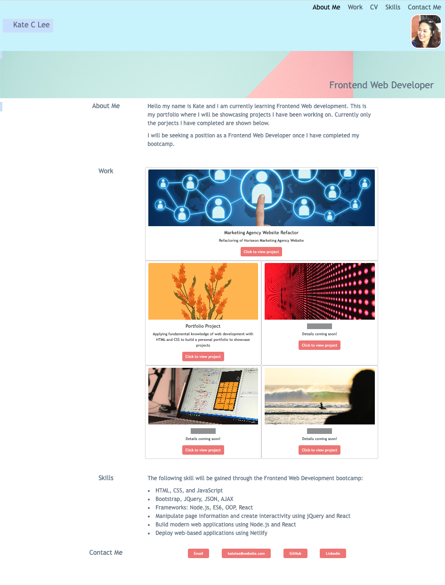

# Bootstrap-portfolio

<b> This is a Portfolio that built on Bootstrap CSS Framework </b>

# Work Portfolio

This is a work portfolio website to showcase completed applications. The portfolio layout is built using the Bootstrap CSS Framework. 

## Description

Different sections can be used to provide information and showcase various projects that has been worked on. 

- Navigation Bar
- Hero Section (using jumbotron feature)
- About Me Section
- Work Section (displayed in a grid formation)
- Skills Section 
- Contact Me Section

## Usage
Sections are linked and when navigation links are clicked it scrolls to the corresponding section of the website. 

When the page is resized or viewed on various screens and devices the layout is responsive and adapts to the viewport. 

Different links can be added and different images can be used to personalise the website. 

## Contributing

Pull requests are welcome. For major changes, please open an issue first
to discuss what you would like to change.

Please make sure to update tests as appropriate.

## License

[MIT](https://choosealicense.com/licenses/mit/)

## The final deployed application should look like this
<b> URL to the deployed website </b>
https://chae-lee.github.io/bootstrap-portfolio/ 

